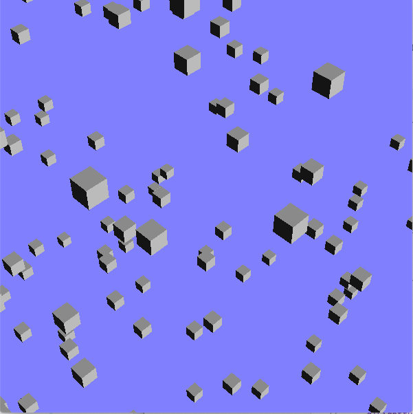
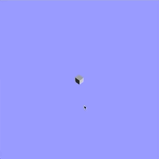
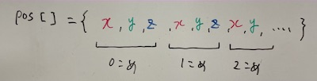
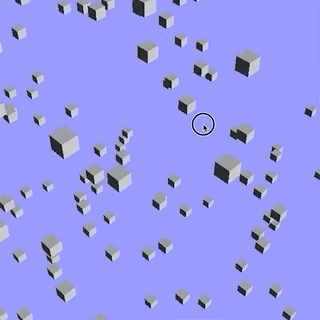

この資料は、従来版の後半第2回 - ワンクリックアクションの制作 に対応します。

## 目次
* [準備](#準備)
* [プログラムの解説](#プログラムの解説)
	* [立方体の配列](#立方体の配列)
	* [課題1](#課題1)
* [マウスクリックによる起爆](#マウスクリックによる起爆)
	* [マウスボタン関数の定義](#マウスボタン関数の定義)
	* [課題2](#課題2)


## 準備
ここのコードをダウンロード、解凍してください。
sample.xcodeproj を開き実行すると以下のような画面が現れます。



## プログラムの解説

タイトルはワンクリックアクションの制作となっており、クリックによる操作がテーマではありますが、まずは使用するアニメーションを作ります。	
目標はたくさんの立方体が爆発するように飛び散る動きです。



### 立方体の配列

サンプルではたくさんの立方体が不規則な位置に配置されています。これは、それぞれの立方体の位置をグローバル変数として用意し、最初に乱数を用いて座標を決めるという処理をおこなっています。

[ main.cpp ]
```cpp
// 一番上
// 立方体256個＊3次元ぶんの値を保存するためのグローバル変数
double pos[3*256];
double vel[3*256]; //あとで使います
bool clicked = false; // あとで使います
//...

void myinit(GLFWwindow** window)
{
	//...

	// pos の初期化
    for(int i=0; i<256; i++){
        pos[3*i  ] = 0;
        pos[3*i+1] = 0;
        pos[3*i+2] = 0;
        //...
    }
}

//...

void display(int frame)
{
    glClear(GL_COLOR_BUFFER_BIT | GL_DEPTH_BUFFER_BIT);

    glMatrixMode(GL_MODELVIEW);
    glLoadIdentity();
    
    // pos の座標に立方体を描く
    for( int i = 0; i < 256; i++ ){
        glPushMatrix();
            glTranslated( pos[3*i], pos[3*i+1], pos[3*i+2] );
            glRotated( 45, 0.0, 1.0, 0.0 );
            makebox( 1.0, 1.0, 1.0, GL_POLYGON );
        glPopMatrix();
    }
}

```

まず配列の使い方ですが、今回は256個の立方体を表示するため、それぞれのx, y, z座標を覚えておく必要があります。

`double pos[3*256]` には3次元＊256個の値が格納されます。
データの内容は、{x, y, z}座標値をひとかたまりとして、これが立方体の数だけ並んでいます。



このようなデータ構造から座標を取り出すには、**かたまりの幅＊立方体の番号**だけ配列を進めるのが便利です。
i番めの立方体のy座標(2番めの要素)を取り出すためには`pos[3*i+1]`とします。
初期化, 描画の部分でどのように各座標にアクセスしているか確認してください。

### 課題1
サンプルではすでに各立方体の位置と速度が初期化されています。
`display`関数のなかで、立方体の位置に速度を加えて更新し、移動させてください。
プログラムの実行と同時に立方体がランダムな方向に動き始めればokです。




## マウスクリックによる起爆

コールバック関数を定義し、クリックした瞬間に一か所にある立方体が爆発するようにします。
具体的には、フラグとなる変数を用意し、クリックが検知されたときに値を書き換えることで立方体を動かすかどうかの判定をおこないます。

### マウスボタン関数の定義

といっても処理が単純かつ覚えるしかない部分でもあるので簡単に流します。
`bool click`というグローバル変数があるのでマウスボタンの動きを検出する関数`MouseButtonFunc`の中でこれを書き換えてください。

[ main.cpp ]
```cpp
void MouseButtonFunc(GLFWwindow* window, int button, int action, int mods)
{
    if( button == GLFW_MOUSE_BUTTON_LEFT && action == GLFW_PRESS )
    {
        clicked = true;
    }
}
```

if文は、**左ボタン**が**押された**ときという条件です。

### 課題2

変数`clicked`が最初は`false`, クリックされた後は`true`の値をとるようになりました。
このフラグを用いてマウスボタンがクリックされたときに移動が始まるようにしてください。

さらに、初期位置を原点にして爆発して見えるようにしてください。


### 課題3
そのほか、マウスボタンを使って動きの制御をおこなってください。
例えばクリックするたびに移動/停止を入れ替える、クリックすると位置を初期化するなど。
