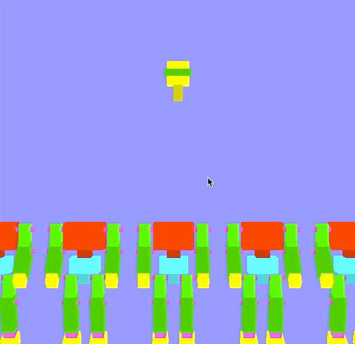
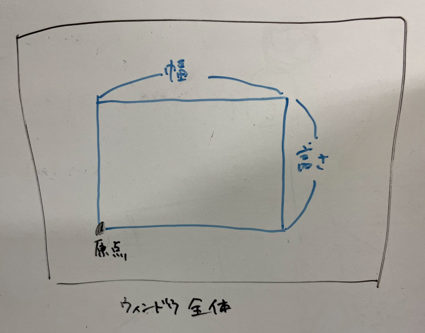

この資料は、従来版の後半第3回 -	タイミングアクションの制作 に対応します。
[このリポジトリ](https://github.com/trnciii/ciesample-timing)からファイルをダウンロードしたら`sample.xcodeproj` を開き、実行できるか確認してください。

この章ではロボット工場でロボットの頭を取り付けるという簡単なゲームを作成します。 ここではタイミング要素をインタラクションに取り入れ、キーを押すとロボットの頭が落ちるようにします。 頭が体の上に乗るとロボット製作成功というルールにします。



また、最後には簡単にですが画像を書き出す方法を紹介します。

## 目次
* [準備](#準備)
	* [プログラム解説](#プログラム解説)
* [頭の投下](#頭の投下)
* [頭と胴体の交差判定](#頭と胴体の交差判定)
	* [課題1](#課題1)
	* [課題2](#課題2)
* [画像の書き出し](#画像の書き出し)
	* [すごく余裕がある人へ](#すごく余裕がある人へ)

## 準備

ダウンロードした状態のプログラムは、右から胴体が10個流れてくるというものです。
今回は以下の順でプログラムを完成させていきます。

1. キーボード操作による頭の投下
2. 胴体との交差判定と動きのコントロール


### プログラム解説

今回使うロボットはすでに[ディスプレイリスト](https://github.com/trnciii/cge2020mac/tree/2_surface#ディスプレイリスト)として定義してあり、`glCallList( ROBO_BODY )`, `glCallList( ROBO_HEAD )`とすることでそれぞれロボットの体と頭をよびだすことができます。

動きをコントロールするための変数として以下がグローバルに定義されています。

```cpp
// 各ロボットの体のx座標
double body_pos_x[MAX_ROBO];

// 各ロボットの頭の座標
double head_pos_x[MAX_ROBO];
double head_pos_y[MAX_ROBO];
```

また`myinit`では各座標の初期化を、`display`関数では胴体の位置更新と描画をおこなっています。

[ void myinit(GLFWwindow** window) ]

```cpp
// ...

	//座標の初期化
	for(int i = 0; i < MAX_ROBO; i++){
		body_pos_x[i] = i*4+8;
		
		head_pos_x[i] = 0.0;
		head_pos_y[i] = 0.0;
		used[i] = false;
		complete[i] = false;
	}

// ...

```

[ void display(int frame) ]

```cpp
// ...

	// 各ロボット位置の更新
	for(int i = 0; i < MAX_ROBO; i++){

		body_pos_x[i] += -0.2;

		// 体の描画
		glTranslated( body_pos_x[i], 0.0, 0.0 );
		glCallList( ROBO_BODY );
		glLoadIdentity();
		
		// 頭の描画
		glTranslated( head_pos_x[i], head_pos_y[i], 0.0 );
		glCallList( ROBO_HEAD );
		glLoadIdentity();
	}

// ...
```

以上が配布プログラムの要点です。

## 頭の投下

適当なキーを押したら頭が落下するようにします。以下、"↓"を押すことに決めて説明をします。

### 考えかた
それぞれの頭部はキーを押すごとに一つづつ落下していきます。
いま何個の頭まで落下しているか数えておき、その範囲だけ動かすようにします。

### 実装
グローバル変数として以下のように`used = 0`を追加してください。

```cpp
//
// ロボットの座標などの配列
//
// 追加. 何個めの頭まで落下したか
int used = 0;
```

`used`はキーを押すごとに増加します。ただし、用意した配列外の数にならないようにします。

```cpp
void KeyFunc(GLFWwindow* window, int key, int scancode, int action, int mods)
{
	// ↓
	if( key == GLFW_KEY_DOWN && action == GLFW_PRESS )
	{
		printf("↓\n");
		if(used<MAX_ROBO) used++; // 追記
	}
}
```

最後に、配列の **[0, used)** の範囲で頭を落下させます。
`display`の中で頭の座標を更新します。

```cpp
void display(int frame){
	// ...

	// 追記分. 各頭部の更新
	for(int i=0; i<used; i++){
		head_pos_y[i] -= 0.8;
	}
	
	// 各胴体位置の更新と描画
	for(int i = 0; i < MAX_ROBO; i++){

		body_pos_x[i] += -0.2;
		// ...
```

以上で、全部で10個ある頭が一個ずつ落下していくという処理ができました。


## 頭と胴体の交差判定

落下する頭が胴体に当たると合体するようにします。
交差判定と、その結果による動きの切り替えを実装します。
動きの切り替えは課題とします。

### 考え方

頭がいずれかの胴体と交差したとき、落下をやめて左方向に動くようにします。
それぞれの頭が交差したかの値を記録する配列を用意し、交差判定とそれをもとにした動きの切り替えをおこないます。

### 実装

まず頭が胴体に当たったかのフラグとなるグローバル変数を用意し、初期化します。
```cpp
//
// ロボットの座標などの配列
//
bool hit[MAX_ROBO];

// ...

void myinit(GLFWwindow** window)
{
	// ...

	//変数の初期化
	for(int i = 0; i < MAX_ROBO; i++){
		body_pos_x[i] = i*4+8;
		
		head_pos_x[i] = 0.0;
		head_pos_y[i] = 0.0;
		
		hit[i] = false;
	}
}
```

[0, used) の範囲の頭について、交差判定をおこないます。
今回は落下位置が画面中央と決まっているので、以下の条件で判定できます。

1. 胴体が左右の真ん中にあるか
2. 頭が適当な高さにあるか ( y = -6 で丁度いい位置らしい )

これらの判定をすべての胴体に対しておこないます。

```cpp
void display(int frame)
{
	// ...

	// 交差判定
	for(int head = 0; head < used; head++)
	{
		for(int body = 0; body < MAX_ROBO; body++)
		{
			// 条件の判定
			bool flag_y = (-7 < head_pos_y[head] ) && ( head_pos_y[head] < -5 );
			bool flag_x = (-1 < body_pos_x[body] ) && ( body_pos_x[body] <  1 );
			
			// あてはまる場合にフラグ(hit)を更新
			if( flag_y && flag_x )
			{
				hit[head] = true;
			}
		}
	}

	// 各頭部の更新
	for(int i=0; i<used; i++){
		// ここを書き換える
	}

	// 各胴体位置の更新と描画
	for(int i = 0; i < MAX_ROBO; i++){
		// ...
	}
```

これで、各頭が胴体と合体したかどうかの配列`hit`が得られました。
この結果を利用して実際に頭が胴体と一緒に動くようにしてください。

### 課題1

各頭部の更新処理 (上のコード参照) を書き換えて最初に示したようなゲームを完成させてください。
以下の条件を想定しますが、成り立っていれば数値を変えてもいいです。

* 胴体に当たった頭部がその胴体と一緒に動くようにしてください。
* 胴体はx方向に -0.2 の速度で動いています。
* 首の高さは y = -6 です

### 課題2

以下のことをおこなってください。

* 見た目の面白さのため、落下の仕方や左右の動きを変更してください。
* ゲーム性を高めるため、点数の計算やゲームオーバー判定、難易度の調整などをおこなってください。


## 画像の書き出し

まえに質問してきた人がいたので、OpenGLで描画している画面を画像として書き出す方法を紹介します。
public domain で公開されている[stb](https://github.com/nothings/stb)というライブラリに含まれる、[stb_image_write.h](https://github.com/nothings/stb/blob/master/stb_image_write.h)というヘッダファイルを使います。

といってもこの部分は配布したプログラムにすでに書かれています。スペースを押すと画面全体をキャプチャします。

```cpp
void KeyFunc(GLFWwindow* window, int key, int scancode, int action, int mods)
{
	// ...

	// スペースキー
	if( key == GLFW_KEY_SPACE && action == GLFW_PRESS )
	{
		printf("SPACE\n");

		int w,h;
		glfwGetFramebufferSize(window, &w, &h); // 画面サイズの取得
		
		unsigned int* image = new unsigned int[w*h]; // ピクセルの配列を用意

		glReadPixels(0, 0, w, h, GL_RGB, GL_UNSIGNED_BYTE, image); // キャプチャ

		stbi_write_png("/適当な場所/capture.png", w, h, 3, image, 3*w); // 書き出し

		delete[] image;
	}
	
	// ...
}
```

以上の部分で**画像を受け取る配列の用意**、**画面のキャプチャ**、**画像の保存**をおこなっています。

実はこのままだと画像の上下が逆になるのですが、今回はこのまま進めます。
すごく余裕がある人は、正しい向きで書き出されるように修正してみるとよい練習になると思います。


### 画像を受け取る配列の用意
まず`glfwGetFramebufferSize`を使って画面の大きさを取得します。`w, h`に幅と高さの値がはいります。
つぎにピクセルの値を保存する配列を用意します。
型は`unsigned int`で、`new`を用いてピクセル数分の配列をつくります。

### 画面のキャプチャ
`glReadPixels`を利用します。
引数は、取得したい画像の ( 原点x, 原点y, 幅, 高さ, 色, 型, 結果をうけとる配列 ) です。
原点と幅については以下のようになっていて、ウィンドウ全体に対して青い部分がキャプチャされます。
画面全体を取得するために、原点と幅、高さをウィンドウと揃えました。

詳しくは[こちら](https://www.khronos.org/registry/OpenGL-Refpages/gl2.1/xhtml/glReadPixels.xml)



### 画像の保存
`stbi_write_png`を利用し、png画像を保存します。
引数は、( ファイル名, 幅, 高さ, 色の数, 画像の配列, 1行の長さ(色数×幅) ) です。
保存場所は各自で書き換えてください。

使い方の詳しい説明はソースファイルに書いてあります。(配布したサンプルまたは[ここ](https://github.com/nothings/stb/blob/master/stb_image_write.h))


